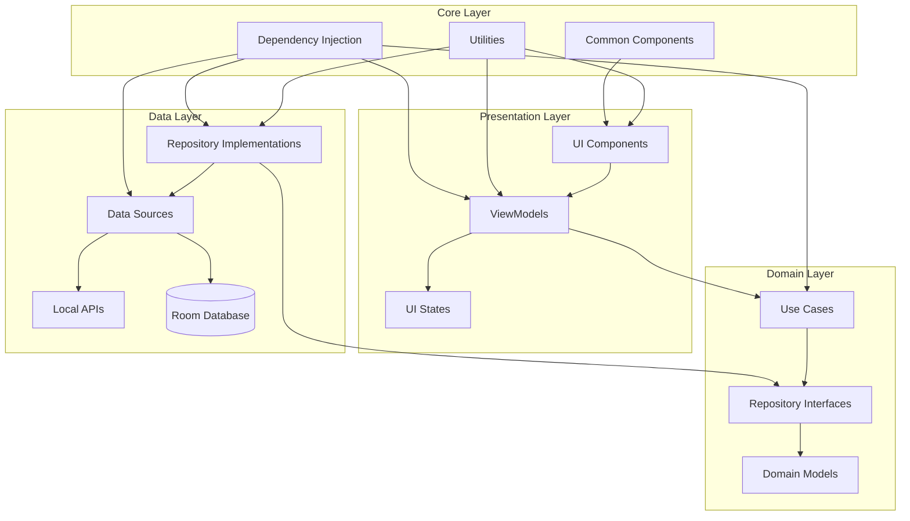

# Design Document: NotiMind (知汇)

## Overview

NotiMind is an Android application that collects, analyzes, and summarizes system notifications using AI. The app follows Google's recommended Now in Android (NIA) architecture, implementing MVVM pattern with Repository, Jetpack Compose for UI, Hilt for dependency injection, Room for local storage, and Kotlin Coroutines & Flow for asynchronous operations.

This document outlines the technical design and architecture of the NotiMind application, providing a blueprint for implementation.

## Architecture

The application follows a modularized clean architecture approach with the following layers:

1. **Presentation Layer (UI)**: Contains UI components built with Jetpack Compose, ViewModels, and UI states/events.
2. **Domain Layer**: Contains use cases, domain models, and repository interfaces.
3. **Data Layer**: Contains repository implementations, data sources, and data models.
4. **Core Layer**: Contains shared components, utilities, and base classes.

### Architecture Diagram



### Module Structure

The application is organized into the following modules:

1. **app**: Application entry point, DI setup, and navigation host
2. **core/model**: Shared data models
3. **core/data**: Data sources and repository implementations
4. **core/database**: Room database setup and DAOs
5. **core/common**: Common utilities and extensions
6. **feature/notification**: Notification collection and display
7. **feature/summary**: AI summary generation and display
8. **feature/settings**: App settings and configuration
9. **ui/common**: Shared UI components and theme

## Components and Interfaces

### 1. Notification Collection Service

```kotlin
class NotificationListenerService : NotificationListenerService {
    override fun onNotificationPosted(sbn: StatusBarNotification) {
        // Process and store notification
    }
    
    override fun onNotificationRemoved(sbn: StatusBarNotification) {
        // Handle removed notifications
    }
}
```

### 2. Repository Interfaces

```kotlin
interface NotificationRepository {
    suspend fun saveNotification(notification: NotificationEntity)
    fun getNotifications(timeRange: TimeRange): Flow<List<NotificationEntity>>
    fun getNotificationsByApp(appPackage: String, timeRange: TimeRange): Flow<List<NotificationEntity>>
    suspend fun clearNotifications(timeRange: TimeRange)
    suspend fun exportNotifications(timeRange: TimeRange): Uri
}

interface SummaryRepository {
    fun getTimeSummaries(timeRange: TimeRange): Flow<List<NotificationSummary>>
    fun getAppSummaries(timeRange: TimeRange): Flow<List<AppNotificationSummary>>
    suspend fun generateSummaries(timeRange: TimeRange)
}

interface UserPreferencesRepository {
    val userPreferencesFlow: Flow<UserPreferences>
    suspend fun updateSummaryStyle(style: SummaryStyle)
    suspend fun toggleDarkTheme(enabled: Boolean)
    suspend fun setDataRetentionPeriod(days: Int)
}
```

### 3. ViewModels

```kotlin
class SummaryViewModel(
    private val summaryRepository: SummaryRepository,
    private val userPreferencesRepository: UserPreferencesRepository
) : ViewModel() {
    // State and event handling
}

class NotificationViewModel(
    private val notificationRepository: NotificationRepository
) : ViewModel() {
    // State and event handling
}

class SettingsViewModel(
    private val userPreferencesRepository: UserPreferencesRepository,
    private val notificationRepository: NotificationRepository
) : ViewModel() {
    // State and event handling
}
```

### 4. Navigation

```kotlin
sealed class Screen(val route: String) {
    object Summary : Screen("summary")
    object Notifications : Screen("notifications")
    object Settings : Screen("settings")
    object PermissionRequest : Screen("permission_request")
}

@Composable
fun NotiMindNavHost(
    navController: NavHostController,
    modifier: Modifier = Modifier
) {
    NavHost(
        navController = navController,
        startDestination = Screen.Summary.route,
        modifier = modifier
    ) {
        composable(Screen.Summary.route) { SummaryScreen() }
        composable(Screen.Notifications.route) { NotificationsScreen() }
        composable(Screen.Settings.route) { SettingsScreen() }
        composable(Screen.PermissionRequest.route) { PermissionRequestScreen() }
    }
}
```

## Data Models

### 1. Core Models

```kotlin
data class NotificationEntity(
    val id: Long = 0,
    val packageName: String,
    val appName: String,
    val title: String?,
    val content: String?,
    val timestamp: Long,
    val category: String?,
    val isRemoved: Boolean = false,
    val extras: Map<String, String> = emptyMap()
)

data class NotificationSummary(
    val id: String,
    val period: TimePeriod,
    val date: LocalDate,
    val categories: Map<NotificationCategory, Int>,
    val highlights: List<SummaryHighlight>,
    val totalCount: Int
)

data class AppNotificationSummary(
    val packageName: String,
    val appName: String,
    val appIcon: Drawable?,
    val notificationCount: Int,
    val categories: Map<NotificationCategory, Int>,
    val highlights: List<SummaryHighlight>
)

data class SummaryHighlight(
    val title: String,
    val content: String,
    val category: NotificationCategory,
    val importance: HighlightImportance
)

enum class NotificationCategory {
    PERSONAL_MESSAGE,
    GROUP_MESSAGE,
    EMAIL,
    SOCIAL_MEDIA,
    NEWS,
    PROMOTION,
    SYSTEM,
    ALERT,
    OTHER
}

enum class TimePeriod {
    MORNING,
    AFTERNOON,
    EVENING,
    NIGHT,
    ALL_DAY
}

enum class HighlightImportance {
    LOW,
    MEDIUM,
    HIGH,
    CRITICAL
}

data class UserPreferences(
    val summaryStyle: SummaryStyle = SummaryStyle.TIME_BASED,
    val isDarkTheme: Boolean = false,
    val dataRetentionPeriod: Int = 30, // days
    val notificationCategoriesToExclude: Set<NotificationCategory> = emptySet()
)

enum class SummaryStyle {
    TIME_BASED,
    APP_BASED
}
```

### 2. Room Database Entities

```kotlin
@Entity(tableName = "notifications")
data class NotificationEntity(
    @PrimaryKey(autoGenerate = true) val id: Long = 0,
    val packageName: String,
    val appName: String,
    val title: String?,
    val content: String?,
    val timestamp: Long,
    val category: String?,
    val isRemoved: Boolean = false
)

@Entity(tableName = "notification_extras")
data class NotificationExtraEntity(
    @PrimaryKey(autoGenerate = true) val id: Long = 0,
    val notificationId: Long,
    val key: String,
    val value: String,
    
    @ForeignKey(
        entity = NotificationEntity::class,
        parentColumns = ["id"],
        childColumns = ["notificationId"],
        onDelete = ForeignKey.CASCADE
    )
)

@Entity(tableName = "summaries")
data class SummaryEntity(
    @PrimaryKey val id: String,
    val period: String,
    val date: Long,
    val summaryJson: String, // Serialized summary data
    val generatedAt: Long
)
```

## Error Handling

The application implements a comprehensive error handling strategy:

1. **Service Resilience**:
   - The NotificationListenerService is designed to restart automatically if it crashes or is killed by the system.
   - A periodic check ensures the service is running and attempts to restart it if necessary.

2. **Database Operations**:
   - All database operations are wrapped in try-catch blocks to handle SQLite exceptions.
   - Failed write operations are retried with exponential backoff.
   - Read operations return empty collections instead of null to avoid null pointer exceptions.

3. **Permission Handling**:
   - The app continuously monitors notification permission status.
   - If permissions are revoked, the app shows a clear message and guidance to restore them.
   - The app gracefully handles denied permissions without crashing.

4. **AI Processing Fallbacks**:
   - If AI processing fails, the app falls back to rule-based categorization.
   - Timeout mechanisms prevent hanging during analysis operations.
   - Error states are properly communicated to the user with actionable feedback.

5. **UI Error States**:
   - Each screen has defined error states with appropriate user feedback.
   - Retry mechanisms are provided for failed operations.
   - Loading states are shown during long operations to improve user experience.

## Testing Strategy

The testing strategy follows the testing pyramid approach:

### 1. Unit Tests

- **Repository Tests**: Verify the correct behavior of repository implementations with mocked data sources.
- **ViewModel Tests**: Ensure ViewModels correctly process data and update UI state.
- **Use Case Tests**: Validate business logic in isolation.
- **Utility Function Tests**: Verify helper functions and extensions.

### 2. Integration Tests

- **Repository + Database Tests**: Verify the interaction between repositories and Room database.
- **Service + Repository Tests**: Ensure the notification service correctly stores data via repositories.
- **ViewModel + Repository Tests**: Validate the flow of data from repositories to ViewModels.

### 3. UI Tests

- **Screen Navigation Tests**: Verify navigation between different screens.
- **UI Component Tests**: Test individual Composable functions.
- **End-to-End Tests**: Simulate user journeys through the app.

### 4. Automated Testing

- CI/CD pipeline with automated test execution.
- Code coverage reports to identify untested code paths.
- Static analysis tools to catch potential issues early.

## Security Considerations

1. **Data Protection**:
   - All notification data is stored locally on the device.
   - Sensitive notification content is stored with encryption.
   - Export functionality includes options for encrypted exports.

2. **Permission Usage**:
   - The app only requests necessary permissions.
   - Clear explanations are provided for each permission request.
   - The app functions with minimal capabilities if permissions are denied.

3. **Privacy**:
   - No data is sent to external servers without explicit user consent.
   - Users can easily delete all stored data.
   - Data retention policies automatically clean up old data.

## Performance Optimization

1. **Background Processing**:
   - AI analysis is performed during device idle time.
   - Batch processing of notifications to reduce database operations.
   - WorkManager for scheduling periodic tasks with battery-friendly constraints.

2. **Database Optimization**:
   - Indices on frequently queried columns.
   - Pagination for large result sets.
   - Efficient query design to minimize processing time.

3. **UI Performance**:
   - Lazy loading of lists and content.
   - Efficient recomposition in Jetpack Compose.
   - Image caching for app icons.
   - Background loading of data with proper loading states.

## Accessibility

1. **Screen Reader Support**:
   - All UI elements have content descriptions.
   - Meaningful announcements for dynamic content changes.
   - Proper focus order for screen reader navigation.

2. **Visual Accessibility**:
   - Support for dynamic text sizing.
   - High contrast mode compatibility.
   - Color schemes tested for color blindness accessibility.

3. **Input Methods**:
   - Support for keyboard navigation.
   - Touch targets of appropriate size.
   - Alternative input method compatibility.

## Implementation Considerations

1. **Modularization Strategy**:
   - Feature modules are independent and can be developed in parallel.
   - Core modules provide shared functionality to feature modules.
   - Clear module boundaries with well-defined APIs.

2. **Dependency Injection**:
   - Hilt for dependency injection across the app.
   - Scoped providers to manage object lifecycles.
   - Test doubles for testing isolated components.

3. **State Management**:
   - Unidirectional data flow with immutable UI states.
   - Events for user actions and UI triggers.
   - StateFlow and SharedFlow for reactive programming.

4. **Concurrency**:
   - Coroutines for asynchronous operations.
   - Dispatchers for appropriate thread management.
   - Flow for reactive data streams.
   - Proper cancellation and error handling in coroutines.

5. **Material 3 Implementation**:
   - Dynamic color support for Material You.
   - Consistent component usage following Material 3 guidelines.
   - Adaptive layouts for different screen sizes.
   - Support for both light and dark themes.